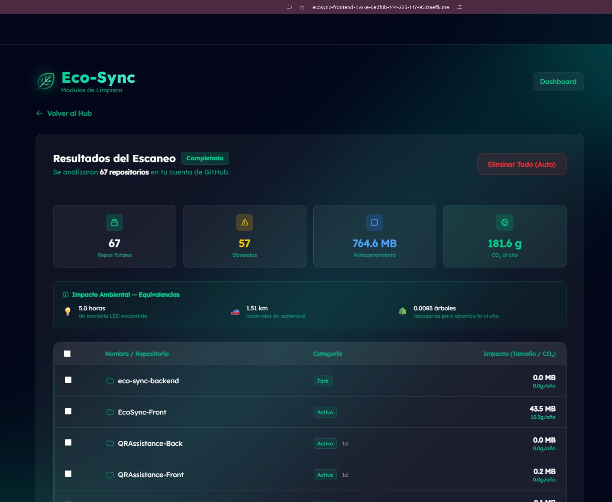

# EcoSync — Frontend

  
  <h1>EcoSync: Limpieza Digital para un Planeta Sostenible</h1>
  
<b>Optimiza tu espacio, reduce tu huella y combate la contaminación invisible.</b>

  

---

## Sobre el Proyecto

EcoSync es una plataforma integral diseñada para combatir la contaminación digital invisible. Nuestra aplicación escanea tu huella a través de múltiples entornos y servicios, detectando basura residual, archivos "muertos", repositorios archivados y recursos duplicados.

### Nuestra Misión y Visión

> **Misión:** Capacitar y empoderar a los usuarios sobre el impacto medioambiental que genera el almacenamiento inútil. Proveemos herramientas intuitivas y seguras para erradicar la "basura digital", reduciendo activamente nuestra huella de carbono digital personal y empresarial.

> **Visión:** Convertirnos en el estándar definitivo para la concientización ecológica de datos a nivel mundial. Visualizamos un internet más liviano, ordenado y sostenible.

---

## Módulos de Limpieza e Inteligencia

La plataforma cuenta con cuatro fases de análisis avanzado integradas en un Hub unificado que permite una gestión centralizada de la basura digital:

<table align="center">
  <tr>
    <td align="center" width="50%">
      <b>1. Gestión de Repositorios (GitHub)</b> 
       
      Analiza repositorios inactivos y forks obsoletos.
    </td>
    <td align="center" width="50%">
      <b>2. Optimización de Nube (Google Drive)</b> 
       
      Identifica archivos duplicados y pesados en la nube.
    </td>
  </tr>
  <tr>
    <td align="center" width="50%">
      <b>3. Almacenamiento Local (PC)</b> 
       
      Localiza temporales y cachés en el disco duro.
    </td>
    <td align="center" width="50%">
      <b>4. Cazador de Cuentas (OSINT)</b> 
       
      Rastrea huellas digitales en plataformas obsoletas.
    </td>
  </tr>
</table>

---

## Funcionamiento y Flujo de Usuario

La plataforma ha sido diseñada bajo una arquitectura de micro-interacciones fluida, utilizando una interfaz minimalista (Glassmorphism) para centrar la atención en la toma de decisiones ecológicas. El proceso se divide en cuatro fases críticas:

1.  **Autenticación y Configuración de Reglas:** Selección del entorno y gestión segura vía OAuth2 para acceso temporal a Drive o GitHub.
2.  **Motor de Análisis de Impacto:** Detección en tiempo real de "Repositorios Zombie", cachés residuales y rastros digitales obsoletos.
3.  **Métricas Ecológicas Comparativas:** Transformación de GB eliminados en indicadores reales (horas de luz LED, CO2 absorbido por árboles).
4.  **Limpieza Inteligente y Segura:** Control dual entre borrado transitorio (Papelera) y destrucción permanente de recursos.

  
Desarrollado por el equipo de EcoSync.

  
<b>Hagamos del internet un lugar más verde.</b>

